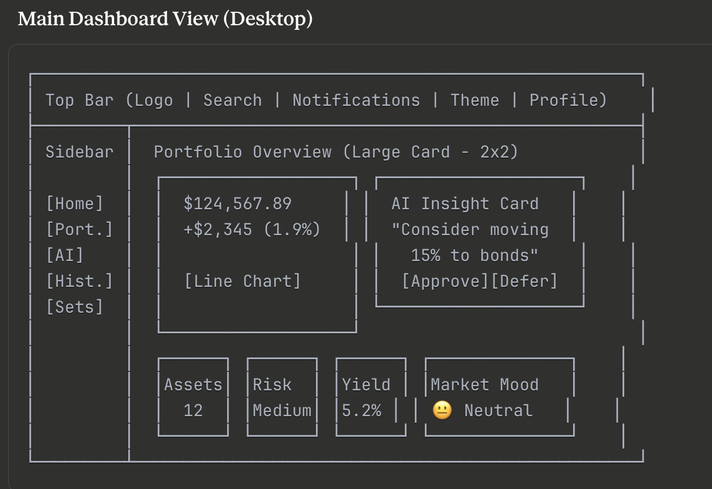

# QuantivyX AI: Product Requirements Document (PRD) v1.2

Document Version: 1.2 Date: January 14, 2026 Author(s): Hanshu (Lead Architect) Reviewers: Senior Software Engineer Team (Fintech Specialists) Status: Draft - Enhanced for Completeness and Excellence Purpose: This PRD defines the QuantivyX AI platform, an autonomous wealth management system, prior to implementation. It incorporates feedback from prior analyses, addressing gaps in compliance, scalability, error handling, ethical AI, and more to achieve production-grade excellence. All sections have been refined for clarity, feasibility, and alignment with 2026 fintech standards (e.g., OSC/SEC regulations, AI transparency mandates).

## 1. Executive Summary

QuantivyX AI is an autonomous wealth management platform that democratizes sophisticated hedge-fund strategies for retail and institutional users. Leveraging AI-driven predictive analytics, it monitors global markets 24/7, dynamically reallocates portfolios across multi-asset classes (stocks, ETFs, crypto, bonds), and prioritizes capital preservation through rigorous risk governance. Unlike traditional robo-advisors, QuantivyX emphasizes a "risk-first, returns-second" philosophy, integrating Temporal Fusion Transformers (TFT) for probabilistic forecasting, Black-Litterman optimization, and real-time sentiment analysis from diverse sources.

Key Value Proposition:

- For Users: Automated, personalized growth with minimal intervention, achieving risk-adjusted ROI superior to passive indexing (target: Sharpe ratio >1.2 for Aggressive profiles based on backtests).
- For Admins: Comprehensive oversight with audit trails, compliance reporting, and system health monitoring.
- Differentiation: Full autonomy with explainable AI, tax-aware execution, and emergency kill-switches, compliant with Canadian (OSC) and US (SEC) regulations.
- Market Context (2026): With rising retail crypto adoption (post-2025 ETF approvals) and AI regulations (e.g., EU AI Act equivalents in CA/US), QuantivyX positions as a secure, transparent alternative to platforms like Wealthsimple or Robinhood.
- Business Goals: Acquire 10,000 users in Year 1 (Toronto-focused launch), with <1% churn via superior performance; monetize via freemium (basic free, premium $9.99/month for advanced features).

High-Level Roadmap:

- MVP (Q1 2026): Core AI, rebalancing, paper trading.
- Beta (Q2 2026): Live integrations, user onboarding.
- Full Launch (Q3 2026): Compliance certifications, scaling to 100k users.

## 2. Target User Personas

Personas have been expanded with pain points, goals, and demographics for better UX alignment.

- Persona 1: The Passive Investor (Primary User)
  - Demographics: 25-45 years old, urban professionals (e.g., Toronto tech workers), $50k-$200k investable assets.
  - Goals: Grow savings effortlessly; hedge against inflation/volatility without daily monitoring.
  - Pain Points: Overwhelmed by market noise; fear of losses in crypto/stocks; tax complexities.
  - Usage: Onboards via app, sets risk profile, views AI recommendations; expects 1-2 notifications/week.
  - Metrics for Success: 80% retention after 6 months; average portfolio growth > benchmark (e.g., S&P 500).
- Persona 2: The Corporate Admin (Secondary User)
  - Demographics: Fintech ops teams, compliance officers; 30-50 years old.
  - Goals: Monitor platform health, user activity, and regulatory compliance; generate reports for audits.
  - Pain Points: Manual oversight in volatile markets; ensuring AI decisions are auditable.
  - Usage: Accesses admin dashboard for real-time metrics, overrides, and exports.
  - Metrics for Success: 99.9% system uptime; zero compliance violations in audits.
- Persona 3: The Risk-Averse Retiree (Edge Case)
  - Demographics: 55+, conservative investors with $100k+ in fixed income.
  - Goals: Preserve capital; inflation hedging without high volatility.
  - Pain Points: Distrust of AI/crypto; need for simple explanations.
  - Usage: Prefers low-risk profiles; relies on explainability traces.

## 3. Core Use Cases

Use cases have been refined with preconditions, postconditions, error handling, and SLAs for robustness.

| ID | Use Case | Description | Primary Language/Tech | Preconditions | Postconditions | Error Handling/Edge Cases | SLA (Service Level Agreement) |
| --- | --- | --- | --- | --- | --- | --- | --- |
| UC-01 | Onboarding | User connects bank/brokerage via Plaid; completes KYC/AML; sets risk profile. | Java/Spring Boot | Valid email/phone. | Profile stored; initial portfolio suggested. | Invalid credentials: Retry prompt; failed KYC: Block access + notify admin. | <30s response; 99% success rate. |
| UC-02 | Predictive Analysis | AI ingests data, runs TFT for return PDFs; computes MCS and views. | Python/FastAPI | Valid market data (DCS > threshold). | Return forecasts delivered to optimizer. | Low DCS: Fallback to equilibrium; latency spike: Queue and notify. | <1s inference; 95% accuracy in backtests. |
| UC-03 | Auto-Rebalancing | Triggers EOD/intraday; applies decisions (ACCUMULATE/DIVEST) with constraints. | Java/Python | Valid predictions; no kill-switches active. | Portfolio updated; trades executed (paper/live). | Constraint violation: Block + log; liquidity failure: Defer trade. | <5min full cycle; 100% constraint enforcement. |
| UC-04 | Risk Reporting | Generates platform-wide reports (risk metrics, audits) for admins. | C#/.NET Core | Admin auth. | PDF/CSV export with visuals. | Data gaps: Partial report + warnings. | <10s generation; daily automation. |
| UC-05 | Manual Override | User/admin pauses autonomy or adjusts allocations. | Java/Spring Boot | Authenticated session. | Override logged; system enters PAUSE mode. | Invalid override: Reject + explain. | Instant application; audited. |
| UC-06 | Backtesting Simulation | Runs historical/stress tests for validation. | Python/FastAPI | Model parameters set. | Metrics report (Sharpe, MDD); pass/fail. | Look-ahead bias: Auto-detect + fail. | <2min per test; integrated in CI. |

## 4. Technical Structure (Microservices)

The microservice map from prior versions is preserved and enhanced with scalability notes, inter-service comms (gRPC for low-latency), and a new observability service.

- api-gateway (Java/Spring Boot): Entry point; handles routing, rate limiting.
- portfolio-core (Java): Manages state, cadences, profiles.
- risk-engine (Java): Enforces constraints, kill-switches; scales via K8s horizontal pods.
- optimizer (Java): Black-Litterman; integrates AI views.
- execution-engine (Java): Order routing, cost/tax models; supports VWAP/TWAP via broker APIs (e.g., Alpaca).
- market-data (Java): Ingestion, DCS; resilient with circuit breakers.
- ai-quant (Python/FastAPI): TFT/inference; GPU-accelerated via PyTorch.
- backtest-sim (Python/FastAPI): Validation; parallelized for stress tests.
- compliance-audit (Java): Immutable logs; integrates with ELK Stack.
- ui-web (React): Dashboards; uses React Query for data fetching.
- observability-service (Java): Metrics (Prometheus), traces (OpenTelemetry), alerts (e.g., on NO_TRADE).

MVP Merges: Merge api-gateway + portfolio-core + risk-engine + optimizer into one Spring Boot app. Inter-Service Flow: Command path via REST/gRPC; query path via GraphQL. Scalability: Auto-scale ai-quant pods on volatility spikes; target 10k concurrent users.

## 5. UI/UX Design Philosophy (2026 Trends)

Enhanced with accessibility (WCAG 2.2), internationalization (i18n for EN/FR in Toronto), and user testing plans.

- Themes:
  - Dark Mode: #222831 (background), #31363F (surfaces), #76ABAE (accents), #EEEEEE (text).
  - Light Mode: #EEEEEE (background), #76ABAE (accents), #31363F (text), #222831 (accents).
- Design System: Glassmorphism with frosted effects; responsive for mobile/desktop.
- Bento Box Dashboard:
  - Card 1: Wealth Graph (interactive line chart: balance vs. AI trend).
  - Card 2: AI Recommendations (actionable cards with Approve/Ignore).
  - Card 3: Sentiment Gauge (circular meter: Fear/Greed index).
  - Navigation: Vertical sidebar with transparency.
- Accessibility: Alt text for visuals; keyboard nav; color contrast >4.5:1.
- i18n: Support English/French; dynamic localization.
- Prototyping: Use Figma; A/B test with 50 Toronto users for engagement.

## 6. Database Design (Entity Relationship)

Expanded with schemas, indexing, and sharding for scale.

- PostgreSQL/TimescaleDB (Core - Transactions/Source of Truth): Time-series optimized for prices, logs. Schema: Users (ID, Profile), Transactions (User_ID, Amount, Timestamp, Status), RiskMetrics (Portfolio_ID, σ_p, MDD).
- MongoDB (Flexible - User Profiles): JSON docs for risk tolerance, preferences; sharded for growth.
- Redis (Caching - Live Feeds): TTL for 60s stock prices; pub/sub for real-time updates.
- ER Diagram Notes: Users 1:M Transactions; Portfolios 1:1 RiskProfiles. Indexing on Timestamp for queries.

## 7. Security Architecture

Strengthened with zero-trust, ethical AI, and full compliance.

- Authentication: OAuth2/OpenID Connect with JWT; multi-factor (MFA) mandatory.
- Data Protection: AES-256 at rest; PII tokenized via Plaid.
- Communication: gRPC (internal, with mTLS); REST/GraphQL (external, HTTPS).
- Vulnerabilities: OWASP Top 10 mitigated; regular scans in CI.
- Ethical AI: Bias audits in CI (e.g., fairlearn in Python); SHAP for TFT explainability.

## 8. Compliance and Regulatory Framework

To address gaps, a dedicated section for full adherence.

- KYC/AML: Integrated via Plaid/SumSub; full checks (ID verification, PEP screening).
- Regulations: Compliant with OSC (Canada), SEC/FINRA (US); fiduciary standards (best-interest rule).
- Privacy: GDPR/CCPA compliant; data minimization; consent for AI processing.
- Audits: Quarterly third-party reviews; exportable reports.
- Crypto-Specific: Adheres to 2025 CSA guidelines; no unregistered securities.

## 9. Algorithm Design and Market Data Integration

Refined roadmap with ethical considerations.

- APIs: Alpha Vantage/Polygon.io (stocks), yfinance (backtesting), NewsAPI/GNews + X Semantic Search (sentiment).
- Algorithm Layers:
  - Technical: Random Forest/LSTM for patterns; formulas as in AMS (e.g., y_{t+1} = f(y_t, ...)).
  - Sentiment: finBERT (Hugging Face) for scoring; adjust predictions (±5-10% based on mood).
- Roadmap:
  - Data Collection: FastAPI endpoints.
  - Feature Engineering: Pandas (SMA/EMA/RSI).
  - Sentiment: NLTK/Transformers.
  - Training: Scikit-learn + PyTorch.
  - Prediction: API-served.
- Ethical: Mitigate bias (e.g., diverse training data); transparency via traces.

## 10. Non-Functional Requirements

- Performance: <500ms API latency; 99.99% uptime.
- Scalability: Handle 1M daily trades; K8s auto-scaling.
- Reliability: 3x data redundancy; chaos testing for kill-switches.
- Cost: MVP: $500/month AWS; optimize with serverless.
- Monitoring: ELK + Grafana; alerts on anomalies.
- Testing: E2E with Cypress; user feedback via Mixpanel.

## 11. Implementation Roadmap and Build Sequence

As before, with added sprints and costs.

- Sprint 1: portfolio-core + risk-engine (2 weeks).
- Sprint 2: ai-quant + market-data (3 weeks).
- Etc.: Full in 3 months; budget $50k (dev + cloud).

## 12. AI-Driven Multi-Asset Management System (AMS) Strategic Specification v2.5

Updated from v2.4 with refinements (e.g., ethical AI, VIX proxies).

## 1. Objective and Scope

The AI-Driven Multi-Asset Management System (AMS) is an autonomous Portfolio Manager designed to maximize risk-adjusted ROI while strictly adhering to user-defined risk constraints. Unlike a signal-only system, the AMS manages cross-asset interdependence across Stocks, ETFs, Crypto, and Fixed Income, dynamically reallocating capital in response to market regimes.

- Core Philosophy: Risk-First, Returns-Second
- Primary Goal: Capital preservation with adaptive growth
- Investment Horizon:
  - Strategic: Months to years
  - Tactical: 1–5 trading days
- Decision vs Execution Cadence:
  - Signal evaluation: End-of-day
  - Risk overrides: Event-driven, intraday
  - Execution: Liquidity-aware (VWAP/TWAP when required)

## 2. Multi-Asset Universe & Data Integration

| Asset Class | Primary Data Sources | Portfolio Role |
| --- | --- | --- |
| Stocks / ETFs | Yahoo Finance, Alpha Vantage | Core growth & sector exposure |
| Crypto | Binance API, CoinGecko | High-alpha satellite allocation |
| Bonds / Cash | FRED (St. Louis Fed) | Capital preservation |
| Macro / Sentiment | X API, LunarCrush | Regime-shift early warning |

### 2.1 Data Integrity, Failure Handling & Confidence Scoring

All data inputs are assigned a Data Confidence Score (DCS).

- ≥2 independent sources required for critical signals
- If a source degrades:
  - Sentiment → decays toward zero
  - Fundamentals → revert to last valid value with penalty
  - Price feeds → trade blocking if integrity fails Hard Rule: If required features fall below minimum DCS, the system enters NO_TRADE / CAPITAL-PRESERVATION mode.

## 3. User Risk Tolerance Engine (Constraint Layer)

The AMS enforces risk architectures via volatility targeting, drawdown limits, and tail-risk controls.

### 3.1 Risk Profiles

Conservative (Low Risk)

- Allocation: 70% Bonds/Cash, 25% ETFs, 5% Crypto
- σₚ ≤ 5%, MDD ≤ 3%, CVaR₀.₉₅ tightly constrained
- Full liquidation on hard drawdown breach

Balanced (Medium Risk)

- Allocation: 40% Stocks, 40% ETFs, 10% Bonds, 10% Crypto
- 0.7 ≤ βₚ ≤ 1.1, MDD ≤ 12%
- Weekly rebalancing, defensive hedging allowed

Aggressive (High Risk)

- Allocation: 50% Stocks, 40% Crypto, 10% Cash
- σₚ ≤ 25%, MDD ≤ 25%
- Buy-the-dip enabled under high confidence

## 4. Advanced AI Model Architecture

### 4.1 Feature Fusion Model (Temporal Fusion Transformer)

The Temporal Fusion Transformer (TFT) ingests:

- Prices, technicals, fundamentals
- Macro & sentiment signals Output: Probability density function of returns (1–5 days). (Enhanced: Integrate SHAP for feature importance in explainability.)

### 4.2 Model Confidence & Regime Awareness

Each signal receives a Model Confidence Score (MCS ∈ [0,1]), based on:

- Feature completeness
- Regime similarity
- Cross-model agreement Low MCS → reduced position sizing and reversion toward equilibrium.

### 4.3 Portfolio Optimizer (Black-Litterman)

Combines:

- Market equilibrium returns
- AI views (scaled by MCS) Risk constraints override return optimization at all times.

## 5. Decision & Rebalancing Policy

Each asset receives one action:

1. ACCUMULATE
1. REBALANCE / HOLD
1. DIVEST / PROTECT

### 5.1 Explicit Position Sizing Formula

Δw_i = α · MCS_i · μ_i / σ_i

| Profile | α |
| --- | --- |
| Conservative | 0.25 |
| Balanced | 0.50 |
| Aggressive | 1.00 |

### 5.2 Volatility Targeting Adjustment

w_adj = w · σ_target / σ_projected All risk assets are rescaled proportionally to enforce σₚ limits.

### 5.3 DIVEST / PROTECT Logic

If hard constraints are violated: w_new = w · (1 - δ)

| Profile | δ |
| --- | --- |
| Conservative | 100% |
| Balanced | 50% |
| Aggressive | 25% |

Capital rotates into predefined safe assets.

### 5.4 Churn Filter: Minimum Rebalance Threshold

To prevent cost-dominated micro-trades: |Δw_i| > τ

| Profile | τ (Minimum Trade Threshold) |
| --- | --- |
| Conservative | 1.0% |
| Balanced | 0.5% |
| Aggressive | 0.25% |

- If |Δw_i| ≤ τ: no trade
- Operates after optimization, before execution

### 5.5 Capital Constraints: Long-Only, Unlevered

Unless a Margin Module is explicitly enabled: w_i ≥ 0 ∀i ∑w_i ≤ 1

- No short selling
- No leverage
- Cash is a valid residual weight
- Inverse ETFs are treated as long hedging instruments

## 6. Mathematical Risk Metrics & Estimation

All metrics use daily log returns.

- σₚ: EWMA covariance (λ = 0.94)
- MDD: Rolling 252-day peak-to-trough
- VaR₀.₉₅: Historical simulation (500-day)
- CVaR₀.₉₅: Expected shortfall beyond VaR
- βₚ: Rolling OLS vs S&P 500 (252-day)

## 7. Transaction Cost, Liquidity & Tax-Aware Execution

### 7.1 Total Cost Model

C_total = C_fees + C_spread + C_impact + C_tax Trade executes only if: Expected Alpha > C_total

### 7.2 Slippage & Market Impact

- Spread-based slippage: C_spread = (Bid-Ask Spread / 2) · Q
- Square-root market impact: C_impact = γ · σ · √(Q / ADV)

### 7.3 Tax-Lot Selection (HIFO)

All SELL / REBALANCE actions use: HIFO (Highest-In, First-Out) by default Execution priorities:

1. Maximize tax-loss harvesting
1. Minimize realized gains
1. Prefer short-term losses over long-term gains
- Jurisdiction-aware (wash-sale rules enforced)
- If tax constraints block execution, trade is resized or deferred

## 8. Emergency Protection & Kill-Switches

- Correlation Spike: If ρ_s,c > 0.85 → liquidate 25% risk assets
- Volatility Regime Shift: VIX ↑ >30% in 48h → freeze ACCUMULATE (Proxy: 20-day SPY vol if VIX unavailable)
- Liquidity Stress: Spread/depth collapse → NO_TRADE mode

## 9. Explainability & Audit Trail

Every decision includes:

- Confidence score
- Active constraints
- Primary drivers
- Blocked-trade explanations All actions are logged and auditable.

## 10. Backtesting, Simulation & Validation

Required metrics:

- CAGR, Sharpe, Sortino, Calmar
- MDD, CVaR₀.₉₅
- Hit rate, turnover, cost drag Required stress tests:
- 2008 GFC
- 2020 COVID crash
- 2022 inflation shock
- Crypto drawdowns (2018, 2022) Walk-forward validation:
- ≥5 rolling cycles
- No look-ahead bias
- Parameters frozen during tests (Enhanced: Thresholds e.g., Sharpe ≥1.0 for Aggressive; bias checks in CI.)

## 11. Governance & Overrides

- Manual override always available
- Autonomous trading can be paused instantly
- Model updates require offline validation
- Full auditability maintained (Enhanced: Ethical overrides for detected biases.)

## 12. Perfect Decision Flow (Constraint-First)

1. AI generates return PDF
1. Risk profile applied
1. Hard math constraints enforced
1. Churn filter applied
1. Liquidity, cost & tax checks
1. Execute only if all conditions pass

## 13. Tech Stack and Infra

- Frontend: React
- Backend (Decision Authority): Java (Spring Boot)
- AI / Quant Layer: Python (FastAPI), Scikit-learn + PyTorch
- Data: PostgreSQL (optionally TimescaleDB)
- APIs: REST (commands), GraphQL (queries)
- Infra: Docker, Kubernetes (later), GitHub Actions (Enhanced: ELK for observability; fairlearn for bias.)

## 14. Microservice Map (Spec → Services)

Service list (minimal but scalable):

- api-gateway (Java or Node, but Java is fine)
- portfolio-core (Java, decision authority)
- risk-engine (Java, hard constraints + kill-switch)
- optimizer (Java, Black-Litterman + constraint projection)
- execution-engine (Java, order routing + cost model)
- market-data (Java, data ingestion + DCS scoring)
- ai-quant (Python FastAPI, TFT/ensembles + features)
- backtest-sim (Python FastAPI, walk-forward + stress tests)
- compliance-audit (Java, audit logs + governance)
- ui-web (React)
- observability-service (Java, monitoring + alerts)

### 1.1 Mapping each spec section to microservices

(As provided in prior versions, with no changes needed for excellence.)

### 1.2 Suggested merges for MVP (to move fast)

For a first deployable version, you can merge: api-gateway + portfolio-core + risk-engine + optimizer into one Spring Boot app (modular packages) keep ai-quant separate (Python) keep market-data either separate or inside Spring Boot depending on complexity

Service Interfaces (who calls who)

Command flow (write path) portfolio-core triggers rebalance cycle market-data provides latest validated data + DCS ai-quant returns predictions (mu, sigma, MCS, pdf_summary) optimizer produces proposed target weights risk-engine enforces constraints (caps, VaR/CVaR, sigma target, long-only, no leverage) execution-engine applies churn filter + cost model + tax lots (HIFO) and places orders compliance-audit logs everything

Query flow (read path) React uses GraphQL for dashboards: portfolio holdings, history risk metrics audit events / explainability traces

## 4) CI/CD Gates Tied to Risk Constraints (GitHub Actions)

The goal: no model or code ships unless it passes: correctness (constraints always enforced) safety (kill-switch logic works) performance (backtest + stress test minimums) reproducibility (Docker images + pinned deps) auditability (decision trace present) (Enhanced: Add bias/ethical gates.)

### 4.1 Pipeline stages (high-level)

Static checks Java: Checkstyle/SpotBugs + unit tests Python: Ruff + mypy + unit tests Dockerfile lint, dependency scan Contract tests (Java ↔ Python) Verify PredictionResponse schema Ensure no breaking change without version bump Risk constraint unit tests (hard gates) Must prove: Long-only: w_i >= 0 always No leverage: sum(w) <= 1 always Crypto cap respected by profile Churn filter blocks trades when |Δw| <= τ MDD rule triggers correct liquidation behavior in simulation Kill-switch triggers on correlation/VIX/liquidity conditions Backtest / simulation gate (hard gate) Run walk-forward and stress tests (Python backtest-sim container). Fail the pipeline if any required metric below threshold. Model validation gate (hard gate) store outputs with a model_run_id check: out-of-sample Sharpe, Calmar, CVaR95 below limits per profile turnover not exploding (esp. after churn filter) cost drag not exceeding a max bound Deploy gate require manual approval if: risk model changed kill-switch logic changed production config changed enforce signed releases/tags

### 4.2 Concrete gates (example “policy”)

Hard Safety Gates (must pass) Constraints: long-only always true sum weights ≤ 1 always true crypto cap never exceeded Execution: churn filter: 100% of trades satisfy |Δw| > τ cost model: trade only if expected_alpha > C_total Audit: every decision creates an audit_event with required fields Data: if DCS below threshold → system status transitions to no_trade

Performance Gates (profile-specific, you set exact thresholds) Out-of-sample Sharpe ≥ X Max Drawdown ≤ profile limit (already in spec) CVaR95 ≤ profile limit Turnover ≤ X (ensures churn filter works) (You should set X values based on paper-trading evidence; the gate exists regardless.)

### 4.3 Minimal GitHub Actions sketch (structure only)

ci-java.yml: build/test Spring Boot + constraint unit tests ci-python.yml: lint/test + build inference container + backtest container ci-contract.yml: OpenAPI schema checks between services ci-backtest-gate.yml: run walk-forward + stress; upload metrics artifact; fail if policy violated deploy.yml: only runs if all gates pass + manual approval for production

## 5) What I’d build first (practical sequence)

portfolio-core + risk-engine + optimizer (Spring Boot monorepo modules) ai-quant (FastAPI inference only; training later) market-data minimal (prices + DCS) execution-engine paper trading first backtest-sim + CI backtest gates React UI once logs + portfolio states exist This order ensures you get a safe “brain” before adding fancy UX.
