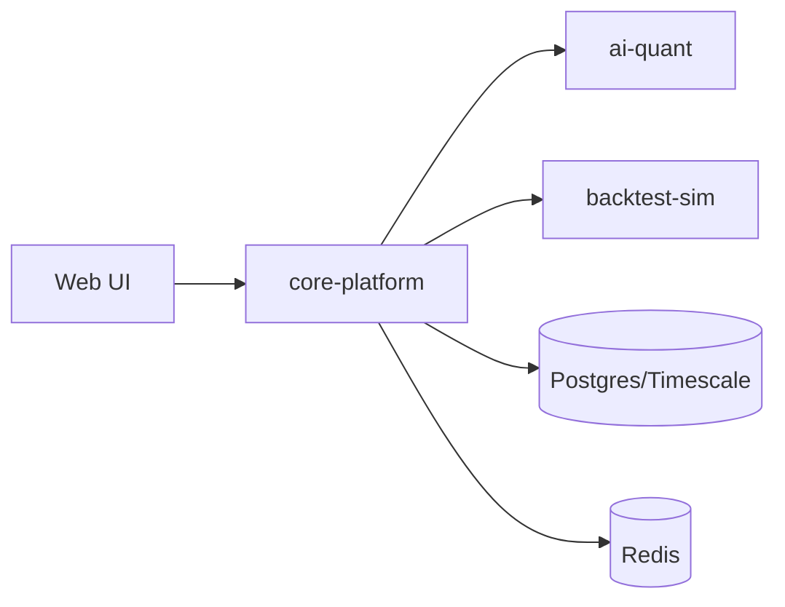

# Architecture Overview

This repository uses a modular monolith for the core decision engine and separates AI inference and backtesting for isolation and scalability.

## Notes
- Command path: core-platform orchestrates risk, optimizer, and execution modules.
- Query path: UI reads portfolio and audit data through core-platform APIs.
